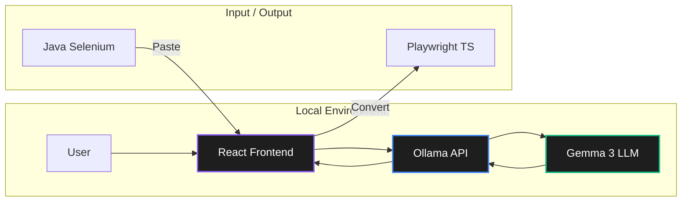

# 🚀 Selenium to Playwright Converter

A professional, AI-powered tool designed to modernize your automation suite by converting **Java Selenium** code into **Playwright TypeScript**. Leveraging local LLMs via Ollama, this tool ensures your data stays private while providing high-quality, best-practice conversions.

---

## 🏗️ Architecture

The system follows a minimalist client-local-server architecture to ensure security and speed.



---

## ✨ Features

- **Side-by-Side Editor**: Real-time comparison between source Selenium code and converted Playwright code.
- **Local AI Processing**: Uses Ollama to run `gemma3:4b` locally—no data ever leaves your machine.
- **Smart Conversion**: Follows Playwright best practices (locators, async/await, modern assertions).
- **Minimalist UI**: Clean, developer-focused interface with glassmorphism and dark mode.
- **One-Click Copy**: Easily capture the converted snapshot for immediate use.

---

## 🛠️ Technology Stack

- **Frontend**: [React 18](https://react.dev/), [TypeScript](https://www.typescriptlang.org/), [Vite](https://vitejs.dev/)
- **Styling**: [Tailwind CSS v4](https://tailwindcss.com/)
- **Editor**: [@monaco-editor/react](https://www.npmjs.com/package/@monaco-editor/react)
- **Icons**: [Lucide React](https://lucide.dev/)
- **Local LLM**: [Ollama](https://ollama.com/) (Gemma 3)

---

## ⚡ Getting Started

### Prerequisites

1.  **Node.js**: Ensure you have Node.js (v18+) installed.
2.  **Ollama**: Install Ollama from [ollama.com](https://ollama.com/).
3.  **Model**: Download the required model:
    ```bash
    ollama pull gemma3:4b
    ```

### Installation

1.  Clone the repository:
    ```bash
    git clone https://github.com/shubham/Selenium_To_Playwright_Converter.git
    cd Selenium_To_Playwright_Converter
    ```

2.  Install frontend dependencies:
    ```bash
    cd frontend
    npm install
    ```

3.  Start the development server:
    ```bash
    npm run dev
    ```

### Usage

1.  Launch the app (Default: `http://localhost:5173`).
2.  Paste your **Java Selenium** code into the left panel.
3.  Click the **Convert Code** button in the header.
4.  Copy the converted **Playwright TypeScript** from the right panel.

---

## 🛡️ Privacy

This application is **Offline-First**. By using Ollama, all code processing happens on your local hardware. Your intellectual property and sensitive test logic never touch external servers or third-party AI APIs.

---

## 📄 License

MIT License. See [LICENSE](LICENSE) for details.
